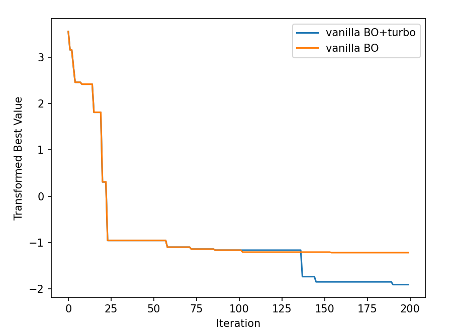

# Unstructured Methods for High-Dimensional Bayesian Optimization

**Abstract.** High-dimensional Bayesian optimization (BO) methods typically work by considering low-dimensional structures, such as additive models or latent structures. Recently, it has been suggested that conventional BO methods can actually work well in high dimensions with minor adjustments. We will explore the strengths and limitations of such approaches, as well as possible improvements.

**Objective.** Develop minor (yet non-naive) improvements on vanilla BO in high-dimensional settings. E.g., vanilla BO where the lengthscales start large and then gradually shrink.

## TODO

- [x] Understand the code in [vanilla_bo_in_highdim](https://github.com/hvarfner/vanilla_bo_in_highdim), rewrote them using BoTorch only for more flexible customization.
- [x] Combine vanilla BO with TuRBO-1 and test the performance (without implementing early stopping strategies).
- [ ] Try out TuRBO with EI (instead of TS) with scaled lengthscales prior.


## Timeline

[20/05/2024] Forked from the official repository for [Vanilla Bayesian Optimization Performs Great in High Dimensions](https://github.com/hvarfner/vanilla_bo_in_highdim), rewrote their ```main.py``` via BoTorch directly. Combined vanilla BO (with scaled lengthscales prior) and TuRBO-1 (adapted from a [BoTorch tutorial](https://botorch.org/tutorials/turbo_1)) in the ```VanillaTuRBO``` class in ```turbo.py```. Conducted experiment on ```levy4_25```:

<p align="center">
  
</p>

In this experiment, after 20 initial points were generated from Sobol, vanilla BO was run for 80 iterations and then switched to TuRBO-1 to run for 100 iterations, the result is compared to running vanilla BO only for 180 iterations. Since the levy4_25 values are negative and with random noise, I transformed them by $\log(-y + 0.15)$.
