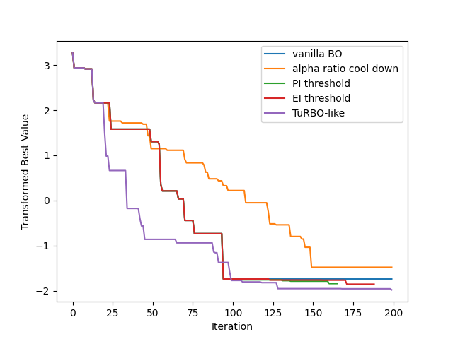

# Unstructured Methods for High-Dimensional Bayesian Optimization

**Abstract.** High-dimensional Bayesian optimization (BO) methods typically work by considering low-dimensional structures, such as additive models or latent structures. Recently, it has been suggested that conventional BO methods can actually work well in high dimensions with minor adjustments. We will explore the strengths and limitations of such approaches, as well as possible improvements.

**Objective.** Develop minor (yet non-naive) improvements on vanilla BO in high-dimensional settings. E.g., vanilla BO where the lengthscales start large and then gradually shrink.

## TODO

- [x] Understand the code in [vanilla_bo_in_highdim](https://github.com/hvarfner/vanilla_bo_in_highdim), rewrote them using BoTorch only for more flexible customization.
- [x] Combine vanilla BO with TuRBO-1 and test the performance (without implementing early stopping strategies).
- [x] Implement the shrinkage of lengthscales and TR side length (use TR side length to scale the location parameter of the lognormal prior). Possible strategies: AR cooling, IQR, success/failure counter.
  - **Question**: Should I fit the model inside the trust region (i.e. neglect data points outside of the trust region)? In doing so, I have to fit a global GP first, then use that model to decide the trust region's side lengths (which depend on lengthscales). Meantime, I cannot guarantee that there are enough data points inside the TR (maybe try to generate points via Sobol?). If I do not fit the model inside the TR, the advantage of using TR is that it is easier to optimize the acquisition function (when lengthscales are small, the locality issue guarantees that the candidate is close to the best observation. However, we cannot utilize the advantage of local GP to learn different hyperparameters in different regions to overcome the heteroscedasticity of the objective function. (I believe TuRBO utilizes this advantage by restarting and running different local GPs in parallel because TuRBO-1 also seems to fit data globally).
  - **Question**: In [this paper](https://arxiv.org/pdf/1612.03117) that introduces alpha-ratio cool down, it was mentioned that in typical situations they expect that $\alpha_{r, n} > 1$ because the reduced lengthscales lead to larger posterior variance. However, this was not true when I ran the experiment (most of the time this ratio was below $0.5$). Meantime, it contradicts with Figure 2 in the [Elastic GP paper](https://proceedings.mlr.press/v70/rana17a/rana17a.pdf). I conjecture that this is because the variance is bounded and hence the additional variance that can be provided by shrinking lengthscales is limited. Unless the model underfits and has almost no variance anywhere in the domain, in that case, it should be indeed beneficial to shrink the lengthscales. 
  - **Question**: The alpha-ratio cool down seems to directly divide the learned lengthscales by $2.0$ (whilst keeping them above the minimum). Unless they do not re-fit the model in every iteration, this does not seem to make sense (as the shrinkage would not affect later iterations). I modified it to shrink the trust region side length, then used this side length to decide the scaling factor on the location parameter of the lognormal prior. However, if the lengthscales aren't really shrinking (as we only shrink the "preference" of lengthscales indirectly), it does not make much sense to shrink the trust region. 
- [x] Run experiments on ```levy4_25``` and compare different methods (e.g., vanilla BO, AR cooling, PI/EI threshold, success/failure counter) to evolve the lengthscale priors and trust region side lengths.
- [ ] Design and implement methods that change TR side length based on the learned lengthscales (i.e. after MAP estimation), or directly scale the learned lengthscales instead of their prior.
- [ ] Design and implement thresholding methods that have a way to schedule the thresholds (e.g. multiply by $0.1$ after the schedule is activated).


## Timeline

[20/05/2024] Forked from the official repository for [Vanilla Bayesian Optimization Performs Great in High Dimensions](https://github.com/hvarfner/vanilla_bo_in_highdim), rewrote their ```main.py``` via BoTorch directly. Combined vanilla BO (with scaled lengthscales prior) and TuRBO-1 (adapted from a [BoTorch tutorial](https://botorch.org/tutorials/turbo_1)) in the ```VanillaTuRBO``` class in ```turbo.py```. Conducted experiment on ```levy4_25```:

<p align="center">
  
</p>

In this experiment, after 20 initial points were generated from Sobol, vanilla BO was run for 80 iterations and then switched to TuRBO-1 to run for 100 iterations, the result is compared to running vanilla BO only for 180 iterations. Since the levy4_25 values are negative and with random noise, I transformed them by $\log(-y + 0.15)$.

<br/><br/>

[28/05/2024] Refactored the code and implemented methods that shrink the TR side length and use the side length to re-scale the location parameter of the lognormal prior of lengthscales (i.e. scale the preference of lengthscales). Running experiments on ```levy4_25``` and comparing the performances of vanilla BO (```DummyState```), PI thresholding, EI thresholding, alpha-ratio cool down, and TuRBO-like methods (i.e. evolve the TR similar to TuRBO, but use EI instead of Thompson sampling). 

**Hyperparameters.** I set $\epsilon = 10^{-3}$ for the PI threshold and $\tau = 10^{-5}$ for the EI threshold. For alpha-ratio cool down, we set $\alpha=1.2$. Seed is 43.

<p align="center">
  
</p>

For the thresholding methods, I found that both the PI and EI thresholds are activated more and more frequently as lengthscales are shrinking, which leads to early stopping (as the minimum side length is reached). I conjecture that this is because smaller lengthscales tend to have smaller acquisition function values. The case of EI is shown in Figure 2 of the elastic GP paper. Consequently, I plan to implement some methods to schedule the thresholds (e.g. multiply them by $0.1$ after being activated) to have more exploration. Both methods slightly outperform the vanilla version.

For the TuRBO-like method (i.e. success/failure counter), the trust region side length changes slowly (stayed at $0.8$ for the first 153 iterations). Yet so far this method performs the best.

For the alpha ratio cool down method, I plan to try improving on it by applying the scale factor (i.e. TR side length) directly to lengthscales instead of their prior. 
